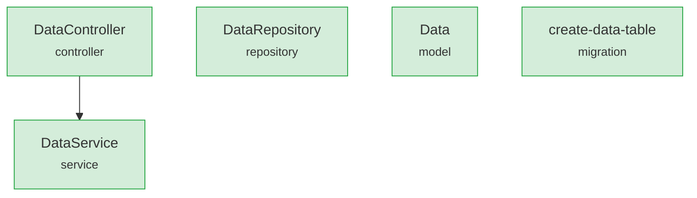
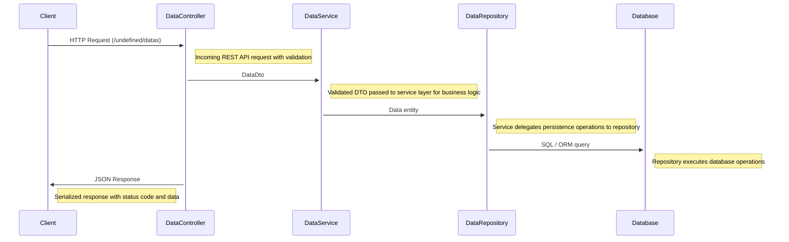

# Solution Analysis: criar um aplicação console em c#, que calcula o IMC

> Generated at 2026-04-02T16:45:44.094Z

## Table of Contents

1. [Repository Overview](#repository-overview)
2. [Requirements](#requirements)
3. [Scope](#scope)
4. [Reuse Analysis](#reuse-analysis)
5. [Solution Architecture](#solution-architecture)
6. [Impact Analysis](#impact-analysis)
7. [Estimation](#estimation)
8. [Summary](#summary)

## Repository Overview

| Metric | Value |
|--------|-------|
| Project | ai-developer-analytics |
| Total files | 72 |
| Total lines | 9.083 |
| Architecture | Event-Driven |
| Services | 0 |
| Controllers | 0 |
| Repositories | 0 |
| API Endpoints | 10 |

### Language Breakdown

| Language | Files | Lines | % |
|----------|-------|-------|---|
| TypeScript | 44 | 6.409 | 70.6% |
| JSON | 19 | 2.562 | 28.2% |
| Markdown | 9 | 112 | 1.2% |

## Requirements

### Functional Requirements

| ID | Priority | Category | Description |
|----|----------|----------|-------------|
| FR-1 | 🟡 should | data | criar um aplicação console em c#, que calcula o IMC |

### Assumptions

- Repository follows Event-Driven architecture pattern
- Primary implementation language is TypeScript (70.6% of codebase)

### Constraints

- Must follow existing patterns: Event-Driven
- API routes must follow existing prefix convention (existing: /:id, /${routeName}, /path)

## Scope

**Estimated complexity**: low

### New Modules

- `data-module`

### In Scope

| Type | Area | Description |
|------|------|-------------|
| new | data-module | New module for data requirements |
| new | data | criar um aplicação console em c#, que calcula o IMC |

## Reuse Analysis

**Reuse score**: 0%

No existing components match the requirements across 0 codebase assets. New implementations are needed.

## Solution Architecture

Solution proposes 5 new component(s) and 0 modification(s) aligned with the Event-Driven architecture (patterns: Event-Driven). 0 integration point(s) with existing code. Technology stack: TypeScript. Estimated complexity: low.

### Component Diagram

### Proposed Components

| Component | Type | New? | Dependencies | Description |
|-----------|------|------|--------------|-------------|
| DataService | service | **Yes** | - | Core business logic for data — handles validation, business rules, and orchestration |
| DataController | controller | **Yes** | DataService | REST controller for data — /undefined/datas endpoints (CRUD + custom actions) |
| DataRepository | repository | **Yes** | - | Data access layer for data — implements data access for persistence operations |
| Data | model | **Yes** | - | Domain entity for data |
| create-data-table | migration | **Yes** | - | Database migration to create data table with required columns and indexes |

### Data Flow Diagram

### Technology Stack

- TypeScript

## Impact Analysis

**Risk level**: 🔴 HIGH

### Impacted Areas

| Impact | Area | Files | Description |
|--------|------|-------|-------------|
| 🔴 high | Database schema | - | 1 migration(s) required: create-data-table. 0 existing script(s) reference related tables. |

### Migration Notes

- Run 1 database migration(s) before deployment
- Create rollback scripts for each migration

### Testing Recommendations

- [ ] Verify database migration against staging environment before production
- [ ] Validate rollback procedure for each migration
- [ ] Unit tests for 5 new component(s)
- [ ] Integration tests for 5 data flow(s)
- [ ] End-to-end regression test suite

## Estimation

| Metric | Value |
|--------|-------|
| **Total hours** | 60.4 |
| **Confidence** | high |
| **Tasks** | 11 |

### Task Breakdown

| Task | Hours | Complexity |
|------|------:|:----------:|
| Codebase comprehension (0 affected module(s), 9.083 total lines) | 1 | low |
| Implement DataService (service) | 8 | low |
| Implement DataController (controller) | 6.9 | medium |
| Implement DataRepository (repository) | 6 | low |
| Implement Data (model) | 2 | low |
| Implement create-data-table (migration) | 3 | low |
| Data flow implementation (5 flows including DTOs, serialization) | 4 | medium |
| Unit tests for 5 new component(s) | 10 | medium |
| Regression testing (risk: high) | 8 | high |
| Database migration & rollback verification (2 note(s)) | 6 | high |
| Code review & documentation | 5.5 | low |

### Effort Distribution

- **Analysis**: 1h (2%) █
- **Implementation**: 26.9h (45%) █████████
- **Database**: 9h (15%) ███
- **Testing**: 18h (30%) ██████
- **Review**: 5.5h (9%) ██

## Summary

| Aspect | Detail |
|--------|--------|
| New components | 5 |
| Modified components | 0 |
| Reusable assets | 0 |
| Risk level | high |
| Estimated hours | 60.4 |
| Confidence | high |
| Complexity | low |
